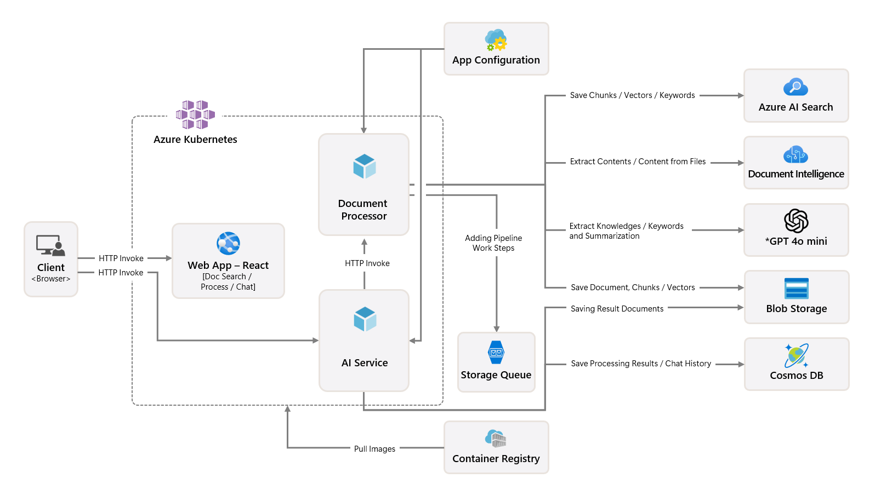

## Technical Architecture

Additional details about the technical architecture of the Knowledge Mining solution accelerator. This describes the purpose and additional context of each component in the solution.

### Ingress Controller
Using Azure's Application Gateway Ingress Controller for Kubernetes. Allowing for load balancing and dynamic traffic management across the application layer.

### Azure Kubernetes
Using Azure Kubernetes Service, the application is deployed as a managed containerized app. This is ideal for deploying a high availability, scalable, and portable application to multiple regions.

### Container Registry
Using Azure Container Registry, container images are built, stored, and managed in a private registry. These container images include the Document Processor, AI Service, and Web App.

### Web App
Using Azure App Service, a web app acts as the UI for the solutions. The app is built with React and TypeScript. it acts as an API client to create an experience for document search, an easy to use upload and processing interface, and an LLM powered conversational user interface.

### Service - Document Processor
Internal kubernetes cluster for document processing pods.

### Document Processor Pods
API end points to facilitate processing of documents that are stored in blob storage. Azure Kubernetes Pod that handles saving document chunks, vectors, and keywords to Azure AI Search and blob storage. It extracts content and context from images in order to derive knowledge, keywords, topics, and summarizations. Based on the file type, different processing pipelines are run to extract the data in the appropriate steps.

### Service - AI Service
Internal kubernetes cluster for AI service pods.

### AI Service Processor Pods
Azure Kubernetes Pod that acts as the solution's orchestration layer (with Semantic Kernel) for interaction with the LLM for the web app. This also includes chat end points to (syncronous and asyncrounous) to stream chat coversations on the web app and to save chat history. This facilitates saving document meta data, keywords and summarizatinons to Cosmos DB to show them through the web app's user interface.

### App Configuration
Using Azure App Configuration, app settings and configurations are centralized and used with the Document Processor Service, AI Service, and Web App.

### Storage Queue
Using Azure Storage Queue, pipeline work steps and processing jobs are added to the storage queue to be picked up and run for their respective jobs. Files uploaded are queue while being saved the blob storage and removed after successful completion. 

### Azure AI Search
Processed and extracted document information is added to an Azure AI Search vecortized index. This vectorized index includes columns relevant to the document set and is integrated with the web app to power the document search and document chatting experience.

### Azure Document Intelligence
One step of the data processing workflow where documents have Optical Character Recognition (OCR) applied to extract data. This includes text and handwriting extraction from documents.

### GPT 4o mini
Using Azure OpenAI, a deployment of the GPT 4o mini model (version 2024-07-18) is used during the data processing workflow to extract content, context, keywords, knowledge, topics and summarization. This model is also used in the web app's chat experience. This model can be changed to a different Azure OpenAI model if desired, but this has not been thoroughly tested and may be affected by the output token limits.

### Blob Storage
Using Azure Blog Storage, unprocessed document are stored as blobs. The data processing workflow reads the file and saves a JSON, text chunks, markdown, embedded text, and meta data including keywords and sumamrization of the processed data back to blob storage. Files uploaded through the web app's upload capabilities are uploaded here.

### Cosmos DB for MongoDB
Using Azure Cosmos DB for MongoDB, documents that have been processed have their processing results saved to a table. The web app chat experience saves chat history to a table. The processed document results and chat history are used to inform prompt recommendations and answers. 